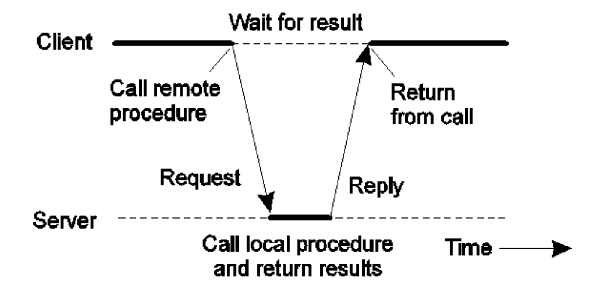

# Use RPCGen to create a client and server process that communicate using Remote Procedure Calls

##

## Objective

Using RPCGen tool for C and C++, create client and server processes that communicate using Remote Procedure Calls. Create three remote procedures that perform anything you wish. But those procedures must accept and return parameters as follows:

- Procedure 1, accepts an integer and returns an integer 
- Procedure 2, accepts an integer and string and returns a floating point
- Procedure 3, accepts an integer and returns a string

## Solution

### Requirements

- First install rpcbind (sudo apt-get install rpcbind)
- Then run rpcinfo (This shows whether the rpcbind is running or not)

### Creating the .x file (Define the RPC program)

- Create the .x file and create a structure defining the different arguments
- Specify the name of the program
- Specify the version number
- Define the program structure (The 3 procedures)

```x
program ADD_PROG{                               // program name
    version ADD_VERS{                           // version name
        int PROC_1(int) = 1;                    // procedure 1(accepts int returns int)                 
        float PROC_2(int, string x<>) = 2;      // procedure 2(accepts int and string returns float)
        string PROC_3(int) = 3;                 // procedure 3(accepts int returns string)
    } = 1;                                      // version number
} = 0x20000001;                                 // program number
```

### Generate C code for the RPC program

- Run the command: `rpcgen -N add.x`
- The '-N' flag tells allows the program to accept multiple arguments which is required for the second procedure
- The 'add.x' is the name of the .x file (input file)
- The output files will be named based on the input file name, for example "add_clnt.c" and "add_svc.c" for the client and server side code, respectively.
- A header file "add.h" will also be created which contains the structure definitions and the function prototypes for the client and server side code.

### Running the make file to compile the code

- Run the command: make
- The make command will compile the code and create the executables
- The Makefile contains instructions for the compiler on how to build the program

### Writing the server and client code

- Using the constraints specified in the "add.h" we create the client.c and server.c file and add the functionality to the procedures
  
#### Server Code

- Here we create the server code that will run the procedures from the client

```c
/*
 * Procedure 1 accepts an integer and returns an integer.
 */
int *proc_1_1_svc(int argp, struct svc_req *rqstp)
{
    static int result;
    printf("Received request for procedure 1 with argument %d\n", argp);
    result = argp * argp; // Square the argument
    return &result;
}

/*
 * Procedure 2 accepts a structure and returns a float.
 */
float *proc_2_1_svc(int argp, char *argp2, struct svc_req *rqstp)
{
    static float result;
    printf("Received request for procedure 2 with arguments %d and %s\n", argp, argp2);
    result = (float)argp / atof(argp2); // convert the string and int to a float and divide them
    return &result;
}

/*
 * Procedure 3 accepts an integer and returns a string
 */
char **proc_3_1_svc(int argp, struct svc_req *rqstp)
{
    static char *result;
    printf("Received request for procedure 3 with argument %d\n", argp);
    result = (char *)malloc(10);
    int n = strlen(result) - 1;
    sprintf(result, "%d is", argp); // convert the int to a string
    result[n] = '\0';
    printf("\nEnd of third procedure; You can exit the server\n");
    printf("**********************************************\n");
    return &result;
}
```

#### Client Code

- Here we create the client code that will call the procedures from the server

```c
int main(int argc, char *argv[])
{
    printf("Client started:\n");
    CLIENT *cl;
    int param1;
    int param2;
    char *param2_string = "2.5";
    int param3;

    /* Create a client handle for the server */
    cl = clnt_create(argv[1], ADD_PROG, ADD_VERS, "tcp");
    if (cl == NULL)
    {
        printf("error: could not connect to server.\n");
        exit(1);
    }

    /* Call procedure 1 */
    printf("\nProcedure 1: Input=integer, Output=integer\n");
    printf("Type a number that you want to be squared:  ");
    scanf(" %d", &param1);
    int procOneResult = *proc_1_1(param1, cl);
    printf("Result from procedure 1: %d\n", procOneResult);

    /* Call procedure 2 */
    printf("\nProcedure 2: Input 1=integer and predefined Input 2=string, Output=float\n");
    printf("Type a number that you want to be divided by 2.5:  ");
    scanf(" %d", &param2);
    float procTwoResult = *proc_2_1(param2, param2_string, cl);
    printf("Result from procedure 2: %f\n", procTwoResult);

    /* Call procedure 3 */
    printf("\nProcedure 3: Input=integer, Output=string\n");
    printf("Type a number that you want to be converted to a string:  ");
    scanf(" %d", &param3);
    char *result_string = *proc_3_1(param3, cl);
    printf("Result from procedure 3: %s\n", result_string);

    /* Clean up and exit */
    clnt_destroy(cl);
    return 0;
}
```

## Project Background

The RPCgen program is concerned with interprocess communication and how processes on different machines (server & client) can exchange information.

### Implementation

When a process on the client machine (A) calls a procedure on the server machine (B), the following steps are taken:

1) The calling process (A) is suspended
2) The execution of the procedure is started on the server machine (B)
3) Information is transported from the caller to the callee in the parameters and comes back in the procedure result. No message passing is visible to the programmer.

#### Overview of RPC communication

Remote Procedure Call      |  Interaction between client and server
:-------------------------:|:-------------------------:
   |  
